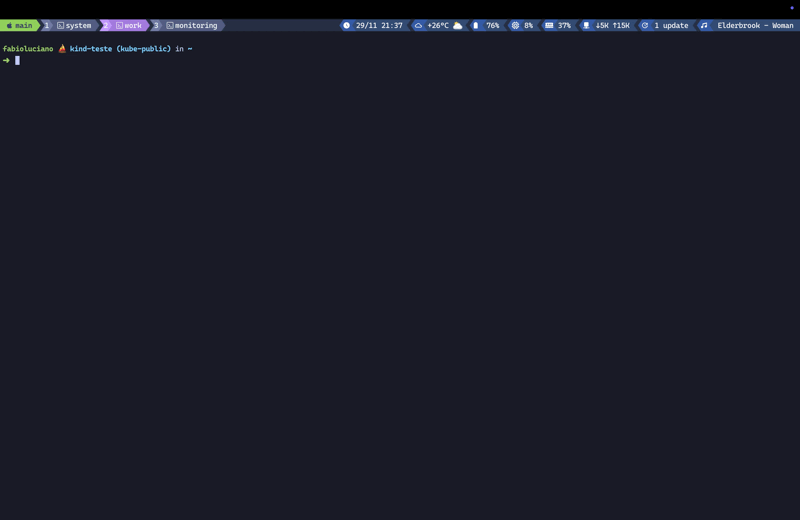
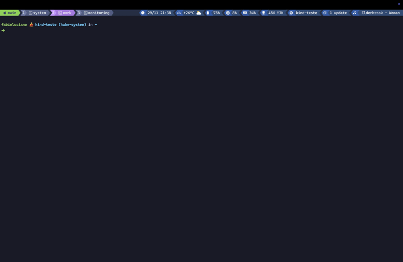
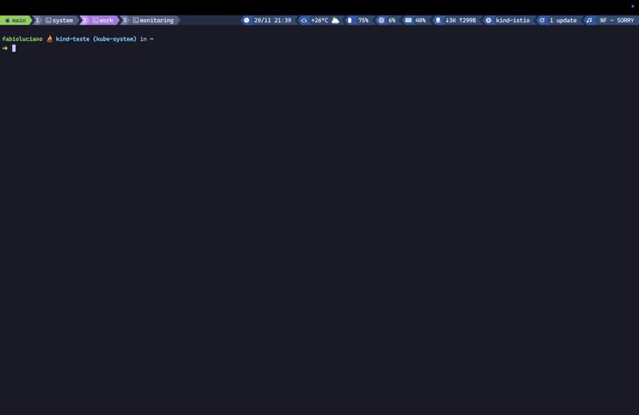

# 🌃 Tokyo Night for tmux

A clean, dark tmux theme inspired by the [Tokyo Night](https://github.com/enkia/tokyo-night-vscode-theme) color scheme. Features a modular plugin system for displaying system information, development tools, and media status in your status bar.


## ✨ Features

- 🎨 Four color variations: **Night**, **Storm**, **Moon**, and **Day**
- 🔌 Modular plugin system with 18 built-in plugins
- ⚡ Performance optimized with intelligent caching
- 🎯 Fully customizable colors, icons, and formats
- 🖥️ Cross-platform support (macOS and Linux)
- 🔤 Powerline-style separators with transparent mode support
- 📊 Dynamic threshold colors for system monitoring (CPU, memory, disk, etc.)
- ⌨️ Interactive popup helpers and selectors

---

## 📦 Installation

### Using [TPM](https://github.com/tmux-plugins/tpm) (recommended)

Add the following to your `~/.tmux.conf`:

```bash
set -g @plugin 'fabioluciano/tmux-tokyo-night'
```

Then press `prefix + I` to install.

### Manual Installation

Clone the repository:

```bash
git clone https://github.com/fabioluciano/tmux-tokyo-night.git ~/.tmux/plugins/tmux-tokyo-night
```

Add to your `~/.tmux.conf`:

```bash
run ~/.tmux/plugins/tmux-tokyo-night/tmux-tokyo-night.tmux
```

---

## 🎨 Theme Variations

| Variation | Description |
|-----------|-------------|
| `night` | Default dark theme (default) |
| `storm` | Slightly lighter dark theme |
| `moon` | Warmer dark theme |
| `day` | Light theme |

```bash
set -g @theme_variation 'night'
```

---

## ⌨️ Built-in Keybindings

The theme provides interactive popup keybindings to help you explore options and navigate your tmux setup.

### Theme Helpers

| Keybinding | Description |
|------------|-------------|
| `prefix + ?` | Options viewer - Shows all available theme options |
| `prefix + B` | Keybindings viewer - Shows all keybindings grouped by plugin |

### Kubernetes Selectors (requires [kubectx/kubens](https://github.com/ahmetb/kubectx))

| Keybinding | Description |
|------------|-------------|
| `prefix + K` | Kubernetes context selector popup |
| `prefix + N` | Kubernetes namespace selector popup |

### Options Viewer (`prefix + ?`)

Displays all available theme options with their default values and current settings. Options are grouped by category and plugin. Also scans and displays options from **all other installed TPM plugins**.


### Keybindings Viewer (`prefix + B`)

Dynamically detects and displays all keybindings from your installed TPM plugins, grouped by plugin name. Also shows tmux built-in keybindings.



### Kubernetes Context Selector (`prefix + K`)

Interactive popup to switch between Kubernetes contexts using fzf. Requires `kubectl-ctx` from [krew](https://krew.sigs.k8s.io/).



### Kubernetes Namespace Selector (`prefix + N`)

Interactive popup to switch between Kubernetes namespaces using fzf. Requires `kubectl-ns` from [krew](https://krew.sigs.k8s.io/).



### Customizing Keybindings

```bash
# Theme helper keys (set to empty string to disable)
set -g @theme_helper_key "?"           # Options viewer
set -g @theme_helper_width "80%"       # Options viewer popup width
set -g @theme_helper_height "80%"      # Options viewer popup height

set -g @theme_keybindings_key "B"      # Keybindings viewer
set -g @theme_keybindings_width "80%"  # Keybindings viewer popup width
set -g @theme_keybindings_height "80%" # Keybindings viewer popup height

# Kubernetes selector keys (see Kubernetes plugin section)
set -g @theme_plugin_kubernetes_context_selector_key "K"
set -g @theme_plugin_kubernetes_namespace_selector_key "N"
```

---

## ⚙️ Global Options

| Option | Description | Default |
|--------|-------------|---------|
| `@theme_variation` | Color scheme: `night`, `storm`, `moon`, `day` | `night` |
| `@theme_plugins` | Comma-separated list of enabled plugins | `datetime,weather` |
| `@theme_disable_plugins` | Disable all plugins: `0` or `1` | `0` |
| `@theme_transparent_status_bar` | Transparent status bar: `true` or `false` | `false` |
| `@theme_bar_layout` | Status bar layout: `single` or `double` | `single` |
| `@theme_left_separator` | Left powerline separator | `` |
| `@theme_right_separator` | Right powerline separator | `` |
| `@theme_transparent_left_separator_inverse` | Inverse left separator (transparent mode) | `` |
| `@theme_transparent_right_separator_inverse` | Inverse right separator (transparent mode) | `` |
| `@theme_status_left_length` | Maximum length of left status | `100` |
| `@theme_status_right_length` | Maximum length of right status | `250` |
| `@theme_helper_key` | Key for options viewer popup | `?` |
| `@theme_helper_width` | Options viewer popup width | `80%` |
| `@theme_helper_height` | Options viewer popup height | `80%` |
| `@theme_keybindings_key` | Key for keybindings viewer popup | `B` |
| `@theme_keybindings_width` | Keybindings viewer popup width | `80%` |
| `@theme_keybindings_height` | Keybindings viewer popup height | `80%` |

### Session & Window Icons

| Option | Description | Default |
|--------|-------------|---------|
| `@theme_session_icon` | Icon before session name | ` ` |
| `@theme_active_window_icon` | Icon for active window | (empty) |
| `@theme_inactive_window_icon` | Icon for inactive windows | (empty) |
| `@theme_zoomed_window_icon` | Icon for zoomed window | (empty) |
| `@theme_pane_synchronized_icon` | Icon when panes are synchronized | `✵` |

### Window Titles

| Option | Description | Default |
|--------|-------------|---------|
| `@theme_active_window_title` | Format for active window title | `#W ` |
| `@theme_inactive_window_title` | Format for inactive window titles | `#W ` |
| `@theme_window_with_activity_style` | Style for windows with activity | `italics` |
| `@theme_status_bell_style` | Style for bell status | `bold` |

### Pane Border

| Option | Description | Default |
|--------|-------------|---------|
| `@theme_active_pane_border_style` | Active pane border color | `dark5` |
| `@theme_inactive_pane_border_style` | Inactive pane border color | `bg_highlight` |

---

## 🔌 Plugins

Enable plugins by adding them to `@theme_plugins`:

```bash
set -g @theme_plugins 'datetime,cpu,memory,battery,kubernetes'
```

### Available Plugins

| Plugin | Description | Dependencies |
|--------|-------------|--------------|
| `datetime` | Date and time display | None |
| `weather` | Current weather conditions | `curl` |
| `battery` | Battery status with charging indicator | None |
| `cpu` | CPU usage percentage with thresholds | None |
| `memory` | Memory usage with thresholds | None |
| `disk` | Disk usage with thresholds | None |
| `network` | Network upload/download speeds | None |
| `loadavg` | System load average with thresholds | None |
| `uptime` | System uptime | None |
| `git` | Git branch and status | `git` |
| `docker` | Docker container count | `docker` |
| `kubernetes` | Kubernetes context and namespace | `kubectl` |
| `hostname` | System hostname | None |
| `homebrew` | Outdated Homebrew packages | `brew` |
| `yay` | Outdated AUR packages | `yay` |
| `spotify` | Currently playing Spotify track | See below |
| `spt` | Spotify via spotify-tui | `spt` |
| `playerctl` | Media player status (Linux) | `playerctl` |

---

## 📋 Plugin Configuration

Each plugin supports common options for customization:

| Option Pattern | Description |
|----------------|-------------|
| `@theme_plugin_<name>_icon` | Plugin icon |
| `@theme_plugin_<name>_accent_color` | Background color |
| `@theme_plugin_<name>_accent_color_icon` | Icon background color |
| `@theme_plugin_<name>_cache_ttl` | Cache duration in seconds |

### Available Colors

You can use any of these color names from the Tokyo Night palette:

| Color | Hex | Color | Hex |
|-------|-----|-------|-----|
| `bg` | `#1a1b26` | `blue0` | `#3d59a1` |
| `bg_dark` | `#16161e` | `blue` | `#7aa2f7` |
| `bg_highlight` | `#292e42` | `blue1` | `#2ac3de` |
| `fg` | `#c0caf5` | `blue2` | `#0db9d7` |
| `fg_dark` | `#a9b1d6` | `blue7` | `#394b70` |
| `red` | `#f7768e` | `cyan` | `#7dcfff` |
| `red1` | `#db4b4b` | `green` | `#9ece6a` |
| `orange` | `#ff9e64` | `green1` | `#73daca` |
| `yellow` | `#e0af68` | `green2` | `#41a6b5` |
| `magenta` | `#bb9af7` | `teal` | `#1abc9c` |
| `purple` | `#9d7cd8` | `white` | `#ffffff` |

---

## 🕐 Datetime

Displays current date and time with support for multiple formats and secondary timezone.

| Option | Description | Default |
|--------|-------------|---------|
| `@theme_plugin_datetime_icon` | Plugin icon | `󰥔` |
| `@theme_plugin_datetime_accent_color` | Background color | `blue7` |
| `@theme_plugin_datetime_accent_color_icon` | Icon background color | `blue0` |
| `@theme_plugin_datetime_format` | Date/time format | `datetime` |
| `@theme_plugin_datetime_timezone` | Secondary timezone | (empty) |
| `@theme_plugin_datetime_show_week` | Show week number | `false` |
| `@theme_plugin_datetime_separator` | Separator between elements | ` ` |

### Predefined Formats

| Format | Example | Description |
|--------|---------|-------------|
| `time` | `14:30` | 24-hour time |
| `time-seconds` | `14:30:45` | 24-hour time with seconds |
| `time-12h` | `02:30 PM` | 12-hour time with AM/PM |
| `time-12h-seconds` | `02:30:45 PM` | 12-hour time with seconds |
| `date` | `29/11` | Day/month |
| `date-us` | `11/29` | Month/day (US format) |
| `date-full` | `29/11/2025` | Full date |
| `date-full-us` | `11/29/2025` | Full date (US format) |
| `date-iso` | `2025-11-29` | ISO 8601 date |
| `datetime` | `29/11 14:30` | Date and time (default) |
| `datetime-us` | `11/29 02:30 PM` | US date and 12h time |
| `weekday` | `Sat 14:30` | Short weekday + time |
| `weekday-full` | `Saturday 14:30` | Full weekday + time |
| `full` | `Sat, 29 Nov 14:30` | Full formatted |
| `full-date` | `Sat, 29 Nov 2025` | Full date without time |
| `iso` | `2025-11-29T14:30:45` | ISO 8601 datetime |

You can also use custom strftime format strings (e.g., `%Y-%m-%d %H:%M`).

### Examples

```bash
# Basic datetime
set -g @theme_plugin_datetime_format 'datetime'

# 12-hour format
set -g @theme_plugin_datetime_format 'time-12h'

# Custom strftime format
set -g @theme_plugin_datetime_format '%A, %B %d'

# With secondary timezone
set -g @theme_plugin_datetime_timezone 'America/New_York'

# With week number
set -g @theme_plugin_datetime_show_week 'true'

# Custom separator
set -g @theme_plugin_datetime_separator ' | '
```

---

## 🌤️ Weather

Displays current weather conditions using [wttr.in](https://wttr.in).

| Option | Description | Default |
|--------|-------------|---------|
| `@theme_plugin_weather_icon` | Plugin icon | `󰖐` |
| `@theme_plugin_weather_accent_color` | Background color | `blue7` |
| `@theme_plugin_weather_accent_color_icon` | Icon background color | `blue0` |
| `@theme_plugin_weather_format` | Display format | `compact` |
| `@theme_plugin_weather_location` | Location (city name) | Auto-detected |
| `@theme_plugin_weather_unit` | Unit: `u` (USCS), `m` (metric), `M` (metric m/s) | Auto |
| `@theme_plugin_weather_cache_ttl` | Cache duration in seconds | `900` |

### Predefined Formats

| Format | Example | Description |
|--------|---------|-------------|
| `compact` | `25°C ⛅️` | Temperature + weather icon (default) |
| `full` | `25°C ⛅️ H:73` | Temperature + icon + humidity |
| `minimal` | `25°C` | Just temperature |
| `detailed` | `São Paulo: 25°C ⛅️` | City + temperature + icon |

You can also use custom [wttr.in format strings](https://github.com/chubin/wttr.in#one-line-output).

### Examples

```bash
# Set location manually
set -g @theme_plugin_weather_location 'London'

# Use Fahrenheit
set -g @theme_plugin_weather_unit 'u'

# Full format with humidity
set -g @theme_plugin_weather_format 'full'

# Custom wttr.in format
set -g @theme_plugin_weather_format '%c+%t+%w'

# Longer cache (1 hour)
set -g @theme_plugin_weather_cache_ttl '3600'
```

---

## 🔋 Battery

Displays battery percentage with dynamic icons and charging indicator. Colors change based on battery level.

| Option | Description | Default |
|--------|-------------|---------|
| `@theme_plugin_battery_icon` | Plugin icon | `󰁹` |
| `@theme_plugin_battery_accent_color` | Background color | `blue7` |
| `@theme_plugin_battery_accent_color_icon` | Icon background color | `blue0` |
| `@theme_plugin_battery_display_mode` | Display mode: `percentage` or `time` | `percentage` |
| `@theme_plugin_battery_icon_charging` | Icon when charging | `󰂄` |
| `@theme_plugin_battery_low_threshold` | Low battery threshold | `30` |
| `@theme_plugin_battery_icon_low` | Icon for low battery | `󰂃` |
| `@theme_plugin_battery_low_accent_color` | Color when battery is low | `red` |
| `@theme_plugin_battery_low_accent_color_icon` | Icon color when battery is low | `red1` |
| `@theme_plugin_battery_cache_ttl` | Cache duration in seconds | `30` |

### Examples

```bash
# Show time remaining instead of percentage
set -g @theme_plugin_battery_display_mode 'time'

# Change low battery threshold
set -g @theme_plugin_battery_low_threshold '20'

# Custom colors for low battery
set -g @theme_plugin_battery_low_accent_color 'orange'
```

---

## 💻 CPU

Displays current CPU usage percentage with dynamic threshold colors.

| Option | Description | Default |
|--------|-------------|---------|
| `@theme_plugin_cpu_icon` | Plugin icon | `` |
| `@theme_plugin_cpu_accent_color` | Background color (normal) | `blue7` |
| `@theme_plugin_cpu_accent_color_icon` | Icon background color (normal) | `blue0` |
| `@theme_plugin_cpu_cache_ttl` | Cache duration in seconds | `2` |
| `@theme_plugin_cpu_warning_threshold` | Warning threshold (%) | `70` |
| `@theme_plugin_cpu_critical_threshold` | Critical threshold (%) | `90` |
| `@theme_plugin_cpu_warning_accent_color` | Warning background color | `yellow` |
| `@theme_plugin_cpu_warning_accent_color_icon` | Warning icon color | `orange` |
| `@theme_plugin_cpu_critical_accent_color` | Critical background color | `red` |
| `@theme_plugin_cpu_critical_accent_color_icon` | Critical icon color | `red1` |

### Examples

```bash
# Change thresholds
set -g @theme_plugin_cpu_warning_threshold '60'
set -g @theme_plugin_cpu_critical_threshold '80'

# Custom warning colors
set -g @theme_plugin_cpu_warning_accent_color 'orange'
set -g @theme_plugin_cpu_warning_accent_color_icon 'yellow'
```

---

## 🧠 Memory

Displays current memory usage with dynamic threshold colors.

| Option | Description | Default |
|--------|-------------|---------|
| `@theme_plugin_memory_icon` | Plugin icon | `` |
| `@theme_plugin_memory_accent_color` | Background color (normal) | `blue7` |
| `@theme_plugin_memory_accent_color_icon` | Icon background color (normal) | `blue0` |
| `@theme_plugin_memory_format` | Format: `percent` or `usage` | `percent` |
| `@theme_plugin_memory_cache_ttl` | Cache duration in seconds | `5` |
| `@theme_plugin_memory_warning_threshold` | Warning threshold (%) | `70` |
| `@theme_plugin_memory_critical_threshold` | Critical threshold (%) | `90` |
| `@theme_plugin_memory_warning_accent_color` | Warning background color | `yellow` |
| `@theme_plugin_memory_warning_accent_color_icon` | Warning icon color | `orange` |
| `@theme_plugin_memory_critical_accent_color` | Critical background color | `red` |
| `@theme_plugin_memory_critical_accent_color_icon` | Critical icon color | `red1` |

### Format Options

- `percent`: Shows percentage (e.g., `45%`)
- `usage`: Shows used/total (e.g., `4.2G/16G`)

### Examples

```bash
# Show used/total memory
set -g @theme_plugin_memory_format 'usage'

# Custom thresholds
set -g @theme_plugin_memory_warning_threshold '80'
set -g @theme_plugin_memory_critical_threshold '95'
```

---

## 💾 Disk

Displays disk usage for a specified mount point with dynamic threshold colors.

| Option | Description | Default |
|--------|-------------|---------|
| `@theme_plugin_disk_icon` | Plugin icon | `󰋊` |
| `@theme_plugin_disk_accent_color` | Background color (normal) | `blue7` |
| `@theme_plugin_disk_accent_color_icon` | Icon background color (normal) | `blue0` |
| `@theme_plugin_disk_mount` | Mount point to monitor | `/` |
| `@theme_plugin_disk_format` | Format: `percent`, `usage`, or `free` | `percent` |
| `@theme_plugin_disk_cache_ttl` | Cache duration in seconds | `60` |
| `@theme_plugin_disk_warning_threshold` | Warning threshold (%) | `70` |
| `@theme_plugin_disk_critical_threshold` | Critical threshold (%) | `90` |
| `@theme_plugin_disk_warning_accent_color` | Warning background color | `yellow` |
| `@theme_plugin_disk_warning_accent_color_icon` | Warning icon color | `orange` |
| `@theme_plugin_disk_critical_accent_color` | Critical background color | `red` |
| `@theme_plugin_disk_critical_accent_color_icon` | Critical icon color | `red1` |

### Format Options

- `percent`: Shows percentage used (e.g., `45%`)
- `usage`: Shows used/total (e.g., `234G/500G`)
- `free`: Shows free space (e.g., `266G`)

### Examples

```bash
# Monitor home directory
set -g @theme_plugin_disk_mount '/home'

# Show free space
set -g @theme_plugin_disk_format 'free'

# Higher thresholds for disk
set -g @theme_plugin_disk_warning_threshold '80'
set -g @theme_plugin_disk_critical_threshold '95'
```

---

## 🌐 Network

Displays network download/upload speeds.

| Option | Description | Default |
|--------|-------------|---------|
| `@theme_plugin_network_icon` | Plugin icon | `󰛳` |
| `@theme_plugin_network_accent_color` | Background color | `blue7` |
| `@theme_plugin_network_accent_color_icon` | Icon background color | `blue0` |
| `@theme_plugin_network_interface` | Network interface (auto-detected if empty) | (empty) |
| `@theme_plugin_network_cache_ttl` | Cache duration in seconds | `2` |

### Examples

```bash
# Specify network interface
set -g @theme_plugin_network_interface 'en0'

# Custom colors
set -g @theme_plugin_network_accent_color 'cyan'
```

---

## 📊 Load Average

Displays system load average with dynamic threshold colors based on CPU core count.

| Option | Description | Default |
|--------|-------------|---------|
| `@theme_plugin_loadavg_icon` | Plugin icon | `󰊚` |
| `@theme_plugin_loadavg_accent_color` | Background color (normal) | `blue7` |
| `@theme_plugin_loadavg_accent_color_icon` | Icon background color (normal) | `blue0` |
| `@theme_plugin_loadavg_format` | Format: `1`, `5`, `15`, or `all` | `1` |
| `@theme_plugin_loadavg_cache_ttl` | Cache duration in seconds | `5` |
| `@theme_plugin_loadavg_warning_threshold_multiplier` | Warning at N × CPU cores | `2` |
| `@theme_plugin_loadavg_critical_threshold_multiplier` | Critical at N × CPU cores | `4` |
| `@theme_plugin_loadavg_warning_accent_color` | Warning background color | `yellow` |
| `@theme_plugin_loadavg_warning_accent_color_icon` | Warning icon color | `orange` |
| `@theme_plugin_loadavg_critical_accent_color` | Critical background color | `red` |
| `@theme_plugin_loadavg_critical_accent_color_icon` | Critical icon color | `red1` |

### Format Options

- `1`: 1-minute load average
- `5`: 5-minute load average
- `15`: 15-minute load average
- `all`: All three values

### Examples

```bash
# Show all load averages
set -g @theme_plugin_loadavg_format 'all'

# Lower warning threshold (1.5x cores)
set -g @theme_plugin_loadavg_warning_threshold_multiplier '1.5'
```

---

## ⏱️ Uptime

Displays system uptime.

| Option | Description | Default |
|--------|-------------|---------|
| `@theme_plugin_uptime_icon` | Plugin icon | `󰔟` |
| `@theme_plugin_uptime_accent_color` | Background color | `blue7` |
| `@theme_plugin_uptime_accent_color_icon` | Icon background color | `blue0` |
| `@theme_plugin_uptime_cache_ttl` | Cache duration in seconds | `60` |

---

## 🌿 Git

Displays current git branch and status. **Only visible inside git repositories.**

| Option | Description | Default |
|--------|-------------|---------|
| `@theme_plugin_git_icon` | Plugin icon | `` |
| `@theme_plugin_git_accent_color` | Background color | `blue7` |
| `@theme_plugin_git_accent_color_icon` | Icon background color | `blue0` |
| `@theme_plugin_git_cache_ttl` | Cache duration in seconds | `5` |

**Status Indicators:**
- `~N`: N files modified
- `+N`: N untracked files

### Examples

```bash
# Change colors for git
set -g @theme_plugin_git_accent_color 'green'
set -g @theme_plugin_git_accent_color_icon 'green2'
```

---

## 🐳 Docker

Displays Docker container count. **Only visible when Docker is running.**

| Option | Description | Default |
|--------|-------------|---------|
| `@theme_plugin_docker_icon` | Plugin icon | `` |
| `@theme_plugin_docker_accent_color` | Background color | `blue7` |
| `@theme_plugin_docker_accent_color_icon` | Icon background color | `blue0` |
| `@theme_plugin_docker_cache_ttl` | Cache duration in seconds | `10` |

**Status Indicators:**
- `N`: N running containers
- `⏹N`: N stopped containers

---

## ☸️ Kubernetes

Displays current Kubernetes context and namespace with interactive selectors.

| Option | Description | Default |
|--------|-------------|---------|
| `@theme_plugin_kubernetes_icon` | Plugin icon | `󱃾` |
| `@theme_plugin_kubernetes_accent_color` | Background color | `blue7` |
| `@theme_plugin_kubernetes_accent_color_icon` | Icon background color | `blue0` |
| `@theme_plugin_kubernetes_display_mode` | Display mode | `connected` |
| `@theme_plugin_kubernetes_show_namespace` | Show namespace | `false` |
| `@theme_plugin_kubernetes_connectivity_timeout` | Connection timeout in seconds | `2` |
| `@theme_plugin_kubernetes_connectivity_cache_ttl` | Connectivity cache duration | `300` |
| `@theme_plugin_kubernetes_cache_ttl` | Cache duration in seconds | `30` |

### Interactive Selectors (requires [kubectl-ctx/ns](https://github.com/ahmetb/kubectx))

| Option | Description | Default |
|--------|-------------|---------|
| `@theme_plugin_kubernetes_context_selector_key` | Key for context selector | `K` |
| `@theme_plugin_kubernetes_context_selector_width` | Popup width | `50%` |
| `@theme_plugin_kubernetes_context_selector_height` | Popup height | `50%` |
| `@theme_plugin_kubernetes_namespace_selector_key` | Key for namespace selector | `N` |
| `@theme_plugin_kubernetes_namespace_selector_width` | Popup width | `50%` |
| `@theme_plugin_kubernetes_namespace_selector_height` | Popup height | `50%` |

### Display Modes

- `always`: Always show context
- `connected`: Only show when cluster is reachable (default)
- `context`: Only show when a context is configured

### Examples

```bash
# Always show kubernetes context
set -g @theme_plugin_kubernetes_display_mode 'always'

# Show namespace
set -g @theme_plugin_kubernetes_show_namespace 'true'

# Change colors
set -g @theme_plugin_kubernetes_accent_color 'purple'

# Change keybindings
set -g @theme_plugin_kubernetes_context_selector_key 'k'
set -g @theme_plugin_kubernetes_namespace_selector_key 'n'

# Disable namespace selector
set -g @theme_plugin_kubernetes_namespace_selector_key ''
```

---

## 🏠 Hostname

Displays the system hostname.

| Option | Description | Default |
|--------|-------------|---------|
| `@theme_plugin_hostname_icon` | Plugin icon | `` |
| `@theme_plugin_hostname_accent_color` | Background color | `blue7` |
| `@theme_plugin_hostname_accent_color_icon` | Icon background color | `blue0` |
| `@theme_plugin_hostname_format` | Format: `short` or `full` | `short` |

---

## 🍺 Homebrew

Displays number of outdated Homebrew packages. **macOS/Linux only.**

| Option | Description | Default |
|--------|-------------|---------|
| `@theme_plugin_homebrew_icon` | Plugin icon | `󰚰` |
| `@theme_plugin_homebrew_accent_color` | Background color | `blue7` |
| `@theme_plugin_homebrew_accent_color_icon` | Icon background color | `blue0` |
| `@theme_plugin_homebrew_additional_options` | Additional options for `brew outdated` | `--greedy` |
| `@theme_plugin_homebrew_cache_ttl` | Cache duration in seconds | `1800` |

---

## 📦 Yay

Displays number of outdated AUR packages. **Arch Linux only.**

| Option | Description | Default |
|--------|-------------|---------|
| `@theme_plugin_yay_icon` | Plugin icon | `󰚰` |
| `@theme_plugin_yay_accent_color` | Background color | `blue7` |
| `@theme_plugin_yay_accent_color_icon` | Icon background color | `blue0` |
| `@theme_plugin_yay_cache_ttl` | Cache duration in seconds | `1800` |

---

## 🎵 Spotify

Displays currently playing Spotify track.

| Option | Description | Default |
|--------|-------------|---------|
| `@theme_plugin_spotify_icon` | Plugin icon | `󰝚` |
| `@theme_plugin_spotify_accent_color` | Background color | `blue7` |
| `@theme_plugin_spotify_accent_color_icon` | Icon background color | `blue0` |
| `@theme_plugin_spotify_format` | Display format | `%artist% - %track%` |
| `@theme_plugin_spotify_max_length` | Maximum text length | `40` |
| `@theme_plugin_spotify_not_playing` | Text when not playing | (empty) |
| `@theme_plugin_spotify_backend` | Backend: `auto`, `osascript`, `playerctl`, `spt`, `shpotify` | `auto` |
| `@theme_plugin_spotify_cache_ttl` | Cache duration in seconds | `5` |

### Format Variables

- `%artist%`: Artist name
- `%track%`: Track name
- `%album%`: Album name

---

## 🎧 Spt (spotify-tui)

Displays currently playing track via [spotify-tui](https://github.com/Rigellute/spotify-tui).

| Option | Description | Default |
|--------|-------------|---------|
| `@theme_plugin_spt_icon` | Plugin icon | `󰝚` |
| `@theme_plugin_spt_accent_color` | Background color | `blue7` |
| `@theme_plugin_spt_accent_color_icon` | Icon background color | `blue0` |
| `@theme_plugin_spt_format` | Display format | `%a - %t` |
| `@theme_plugin_spt_cache_ttl` | Cache duration in seconds | `5` |

---

## 🎶 Playerctl

Displays media player status using [playerctl](https://github.com/altdesktop/playerctl). **Linux only.**

| Option | Description | Default |
|--------|-------------|---------|
| `@theme_plugin_playerctl_icon` | Plugin icon | `󰝚` |
| `@theme_plugin_playerctl_accent_color` | Background color | `blue7` |
| `@theme_plugin_playerctl_accent_color_icon` | Icon background color | `blue0` |
| `@theme_plugin_playerctl_format` | Display format | `{{artist}} - {{title}}` |
| `@theme_plugin_playerctl_ignore_players` | Players to ignore | `IGNORE` |
| `@theme_plugin_playerctl_cache_ttl` | Cache duration in seconds | `5` |

---

## 📝 Complete Configuration Example

```bash
# ~/.tmux.conf

# Theme variation
set -g @theme_variation 'night'

# Enable plugins
set -g @theme_plugins 'datetime,weather,battery,cpu,memory,disk,git,kubernetes,spotify'

# Transparent mode (optional)
set -g @theme_transparent_status_bar 'false'

# Session icon
set -g @theme_session_icon ''

# Datetime configuration
set -g @theme_plugin_datetime_format 'datetime'
set -g @theme_plugin_datetime_timezone 'America/New_York'
set -g @theme_plugin_datetime_show_week 'true'

# Weather configuration
set -g @theme_plugin_weather_location 'New York'
set -g @theme_plugin_weather_format 'full'

# Battery configuration
set -g @theme_plugin_battery_display_mode 'percentage'
set -g @theme_plugin_battery_low_threshold '20'

# CPU with custom thresholds
set -g @theme_plugin_cpu_warning_threshold '60'
set -g @theme_plugin_cpu_critical_threshold '85'

# Memory with custom format
set -g @theme_plugin_memory_format 'usage'

# Disk monitoring /home
set -g @theme_plugin_disk_mount '/home'
set -g @theme_plugin_disk_format 'free'

# Kubernetes configuration
set -g @theme_plugin_kubernetes_display_mode 'connected'
set -g @theme_plugin_kubernetes_show_namespace 'true'
set -g @theme_plugin_kubernetes_accent_color 'purple'

# Spotify configuration
set -g @theme_plugin_spotify_format '%artist% - %track%'
set -g @theme_plugin_spotify_max_length '30'

# Custom colors for git
set -g @theme_plugin_git_accent_color 'green'
set -g @theme_plugin_git_accent_color_icon 'green2'

# Load TPM
set -g @plugin 'tmux-plugins/tpm'
set -g @plugin 'fabioluciano/tmux-tokyo-night'

run '~/.tmux/plugins/tpm/tpm'
```

---

## 🐛 Troubleshooting

### Plugin not showing?

1. Make sure the plugin is listed in `@theme_plugins`
2. Check if the required dependency is installed
3. Some plugins are conditional (git, docker, kubernetes) and only show when relevant

### Performance issues?

The theme uses intelligent caching. You can adjust cache TTL for each plugin:

```bash
set -g @theme_plugin_weather_cache_ttl '3600'  # 1 hour
```

### Colors not displaying correctly?

Make sure your terminal supports true color:

```bash
set -g default-terminal "tmux-256color"
set -ag terminal-overrides ",xterm-256color:RGB"
```

### Clear cache

If you experience stale data:

```bash
rm -rf ~/.cache/tmux-tokyo-night/
tmux source ~/.tmux.conf
```

### View all options

Press `prefix + ?` to open the options viewer popup with all available options and their current values.

### View all keybindings

Press `prefix + B` to see all keybindings from your installed plugins, dynamically grouped by plugin.

---

## 🙏 Credits

- Color scheme inspired by [Tokyo Night](https://github.com/enkia/tokyo-night-vscode-theme) by enkia
- Weather data provided by [wttr.in](https://wttr.in)
