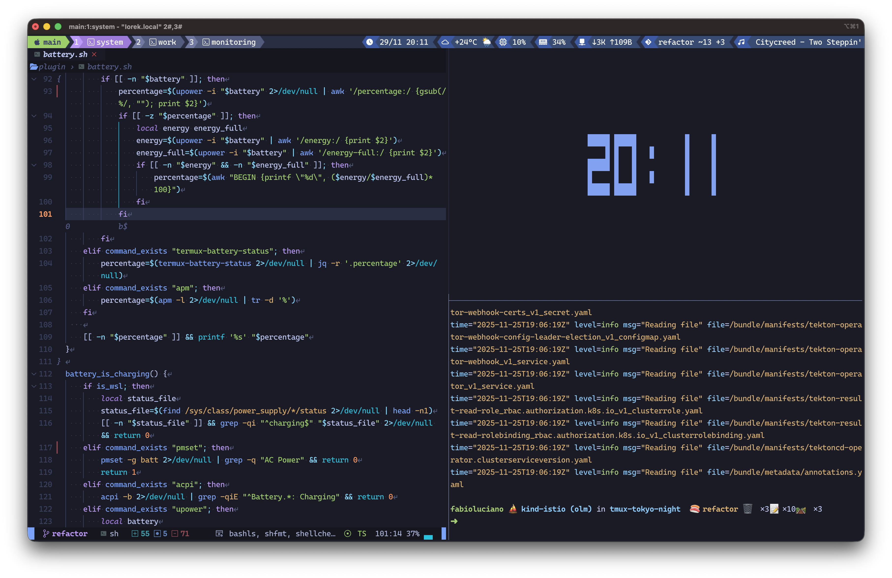
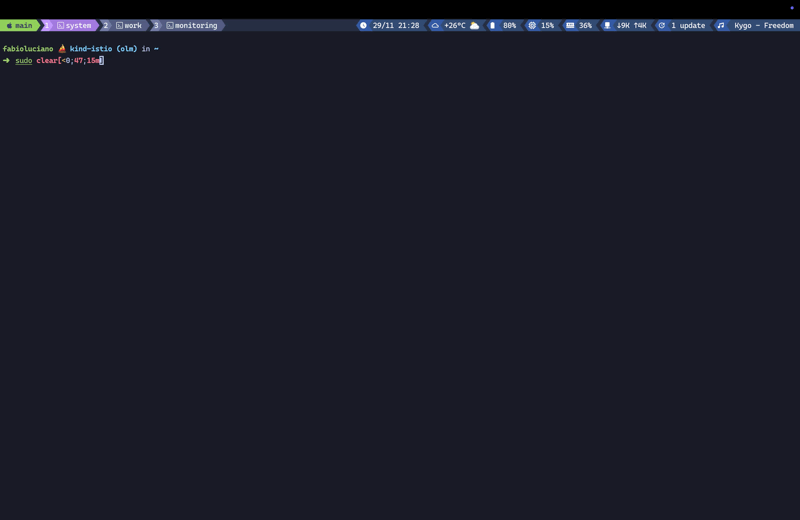

# 🌃 Tokyo Night for tmux

A clean, dark tmux theme inspired by the [Tokyo Night](https://github.com/enkia/tokyo-night-vscode-theme) color scheme. Features a modular plugin system with 24 built-in plugins for displaying system information, development tools, and media status.




## ✨ Features

- 🎨 **Four color variations** - Night, Storm, Moon, and Day
- 🔌 **24 built-in plugins** - System monitoring, development tools, media players
- ⚡ **Performance optimized** - Intelligent caching system
- 🎯 **Fully customizable** - Colors, icons, formats, and separators
- 🖥️ **Cross-platform** - macOS, Linux, and BSD support
- ⌨️ **Interactive features** - Popup helpers and selectors

## 📚 Documentation

- **[Installation](../../wiki/Installation)** - Setup with TPM or manual installation
- **[Quick Start](../../wiki/Quick-Start)** - Get up and running in minutes
- **[Theme Variations](../../wiki/Theme-Variations)** - Explore Night, Storm, Moon, and Day
- **[Global Configuration](../../wiki/Global-Configuration)** - Configure status bar layout and separators
- **[Plugin System](../../wiki/Plugin-System-Overview)** - Complete reference for all 24 plugins
- **[Interactive Keybindings](../../wiki/Interactive-Keybindings)** - Popup helpers and selectors
- **[Custom Colors & Theming](../../wiki/Custom-Colors-Theming)** - Advanced customization
- **[Performance & Caching](../../wiki/Performance-Caching)** - Optimize for your workflow
- **[Troubleshooting](../../wiki/Troubleshooting)** - Common issues and solutions

## 🚀 Quick Start

### Installation

Add to your `~/.tmux.conf`:

```bash
set -g @plugin 'fabioluciano/tmux-tokyo-night'
```

Press `prefix + I` to install with [TPM](https://github.com/tmux-plugins/tpm).

### Basic Configuration

```bash
# Choose theme variation
set -g @theme_variation 'night'

# Enable plugins
set -g @theme_plugins 'datetime,weather,battery,cpu,memory'

# Auto-detect OS icon
set -g @theme_session_icon 'auto'
```

See **[Quick Start Guide](../../wiki/Quick-Start)** for more examples.

## 🎨 Theme Variations

| Variation | Description |
|-----------|-------------|
| `night` | Deep dark theme (default) |
| `storm` | Lighter dark theme |
| `moon` | Balanced medium theme |
| `day` | Light theme |

```bash
set -g @theme_variation 'night'
```

Learn more: **[Theme Variations](../../wiki/Theme-Variations)**

## ⌨️ Interactive Features

| Keybinding | Feature |
|------------|---------|
| `prefix + ?` | **Options viewer** - Browse all theme settings |
| `prefix + B` | **Keybindings viewer** - View all keybindings |
| `prefix + K` | **Kubernetes context selector** - Switch contexts |
| `prefix + N` | **Kubernetes namespace selector** - Switch namespaces |



Learn more: **[Interactive Keybindings](../../wiki/Interactive-Keybindings)**

## 🔌 Available Plugins

The theme includes 26 built-in plugins organized by category:

### 📅 Time & Date

- **[datetime](../../wiki/Datetime)** - Customizable date and time display

### 🌡️ System Monitoring

- **[cpu](../../wiki/CPU)** - CPU usage with dynamic thresholds
- **[memory](../../wiki/Memory)** - RAM usage with format options
- **[disk](../../wiki/Disk)** - Disk space with threshold warnings
- **[loadavg](../../wiki/LoadAvg)** - System load average monitoring
- **[temperature](../../wiki/Temperature)** - CPU temperature
- **[uptime](../../wiki/Uptime)** - System uptime display
- **[brightness](../../wiki/Brightness)** - Screen brightness level

### 🌐 Network & Connectivity

- **[network](../../wiki/Network)** - Bandwidth monitoring
- **[wifi](../../wiki/WiFi)** - WiFi status with signal strength
- **[vpn](../../wiki/VPN)** - VPN connection with multiple providers
- **[external_ip](../../wiki/External-IP)** - Public IP address display
- **[bluetooth](../../wiki/Bluetooth)** - Bluetooth devices with battery
- **[weather](../../wiki/Weather)** - Weather with custom formats

### 💻 Development

- **[git](../../wiki/Git)** - Git branch with change indicators
- **[docker](../../wiki/Docker)** - Container count (running/stopped)
- **[kubernetes](../../wiki/Kubernetes)** - K8s context with interactive selectors
- **[cloud](../../wiki/Cloud)** - Cloud provider context (AWS/GCP/Azure)

### 📦 Package Managers

- **[homebrew](../../wiki/Homebrew)** - Brew updates
- **[yay](../../wiki/Yay)** - AUR updates

### 🎵 Media

- **[spotify](../../wiki/Spotify)** - Now playing
- **[playerctl](../../wiki/Playerctl)** - Media player
- **[volume](../../wiki/Volume)** - Volume level

### 🖥️ System Info

- **[battery](../../wiki/Battery)** - Battery with charge/time modes
- **[hostname](../../wiki/Hostname)** - System hostname display

**Enable plugins:**

```bash
set -g @theme_plugins 'datetime,battery,cpu,memory,git,docker'
```

See **[Plugin System Overview](../../wiki/Plugin-System-Overview)** for complete documentation.

### Platform Compatibility

| Plugin | Linux | macOS | WSL | Notes |
|--------|-------|-------|-----|-------|
| **battery** | ✅ | ✅ | ✅ | Requires `acpi`/`upower` (Linux), `pmset` (macOS) |
| **bluetooth** | ✅ | ✅ | ⚠️ | Limited battery support on macOS |
| **brightness** | ✅ | ❌ | ✅ | Requires `brightnessctl`/`light`/`xbacklight` |
| **cloud** | ✅ | ✅ | ✅ | AWS/GCP/Azure context detection |
| **cpu** | ✅ | ✅ | ✅ | Native support via `/proc/stat` or `vm_stat` |
| **datetime** | ✅ | ✅ | ✅ | Universal |
| **disk** | ✅ | ✅ | ✅ | Uses `df` command |
| **docker** | ✅ | ✅ | ✅ | Requires Docker daemon |
| **external_ip** | ✅ | ✅ | ✅ | Requires internet connection |
| **git** | ✅ | ✅ | ✅ | Requires git repository |
| **homebrew** | ✅ | ✅ | ✅ | Requires Homebrew installed |
| **hostname** | ✅ | ✅ | ✅ | Universal |
| **kubernetes** | ✅ | ✅ | ✅ | Requires `kubectl` |
| **loadavg** | ✅ | ✅ | ✅ | Native support via `/proc/loadavg` or `sysctl` |
| **memory** | ✅ | ✅ | ✅ | Native support via `/proc/meminfo` or `vm_stat` |
| **network** | ✅ | ✅ | ✅ | Bandwidth monitoring |
| **playerctl** | ✅ | ❌ | ✅ | Linux only - MPRIS protocol |
| **spotify** | ✅ | ✅ | ✅ | macOS: native, Linux: playerctl/spt |
| **spt** | ✅ | ✅ | ✅ | Requires `spotify-tui` |
| **temperature** | ✅ | ✅ | ⚠️ | Linux: sensors/sysfs, macOS: requires `osx-cpu-temp` |
| **uptime** | ✅ | ✅ | ✅ | Universal |
| **volume** | ✅ | ✅ | ⚠️ | Linux: pactl/pamixer, macOS: osascript |
| **vpn** | ✅ | ✅ | ⚠️ | Platform-specific VPN clients |
| **weather** | ✅ | ✅ | ✅ | Requires internet connection |
| **wifi** | ✅ | ✅ | ❌ | Linux: nmcli/iwconfig, macOS: airport |
| **yay** | ✅ | ❌ | ✅ | Arch Linux only - AUR helper |

**Legend:**
- ✅ Fully supported
- ⚠️ Partial support or requires specific setup
- ❌ Not supported

## ⚙️ Configuration

### Global Options

```bash
# Theme variation
set -g @theme_variation 'night'

# Status bar position
set -g @theme_status_position 'bottom'

# Separators
set -g @theme_left_separator ''
set -g @theme_right_separator ''

# Session icon (auto-detects OS)
set -g @theme_session_icon 'auto'
```

### Plugin Customization

Each plugin supports:

- **Icon** - Custom icon character
- **Accent color** - Background color
- **Cache TTL** - Update frequency
- **Display conditions** - Show/hide based on thresholds

```bash
# Example: Customize CPU plugin
set -g @theme_plugin_cpu_icon ''
set -g @theme_plugin_cpu_accent_color 'red'
set -g @theme_plugin_cpu_cache_ttl 2

# Hide battery when above 50%
set -g @theme_plugin_battery_display_threshold '50'
set -g @theme_plugin_battery_display_condition 'le'

# Show CPU only when above 70%
set -g @theme_plugin_cpu_display_threshold '70'
set -g @theme_plugin_cpu_display_condition 'gt'
```

**Available conditions:** `le` (≤), `lt` (<), `ge` (≥), `gt` (>), `eq` (=), `ne` (≠), `always`

Learn more:

- **[Global Configuration](../../wiki/Global-Configuration)**
- **[Custom Colors & Theming](../../wiki/Custom-Colors-Theming)**
- **[Performance & Caching](../../wiki/Performance-Caching)**

## 📝 Example Configuration

```bash
# ~/.tmux.conf

# Theme variation
set -g @theme_variation 'night'

# Auto-detect OS icon
set -g @theme_session_icon 'auto'

# Enable plugins
set -g @theme_plugins 'datetime,weather,battery,cpu,memory,git,docker,kubernetes'

# Customize datetime
set -g @theme_plugin_datetime_format 'datetime'

# Set weather location
set -g @theme_plugin_weather_location 'New York'

# Kubernetes with namespace
set -g @theme_plugin_kubernetes_show_namespace 'true'

# Load TPM
set -g @plugin 'tmux-plugins/tpm'
set -g @plugin 'fabioluciano/tmux-tokyo-night'
run '~/.tmux/plugins/tpm/tpm'
```

See **[Quick Start](../../wiki/Quick-Start)** for more configuration examples.

## 🙏 Credits

- Color scheme inspired by [Tokyo Night](https://github.com/enkia/tokyo-night-vscode-theme) by enkia
- Weather data provided by [wttr.in](https://wttr.in)

## 📄 License

MIT License - see LICENSE file for details
