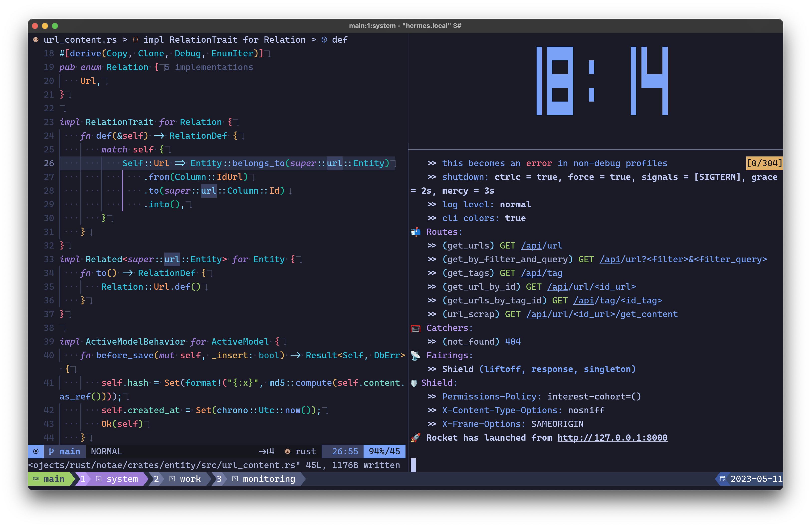
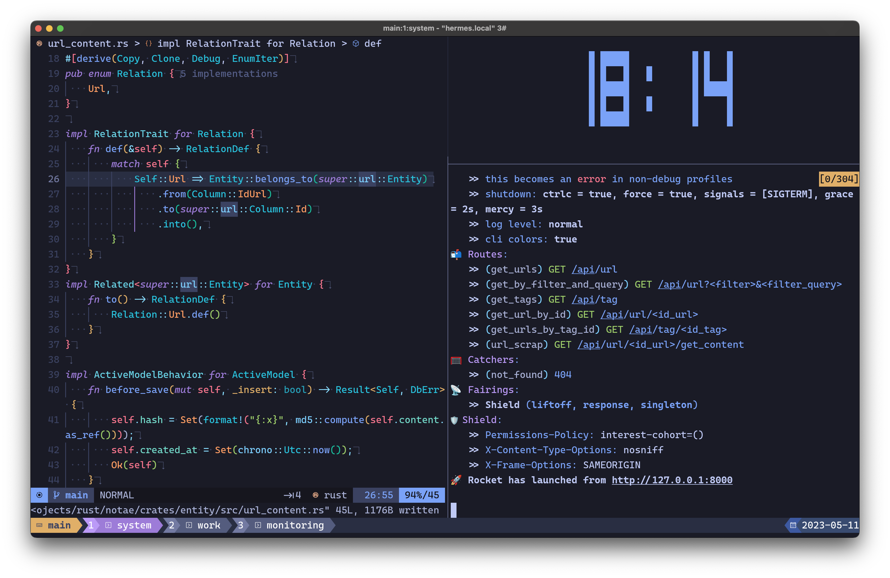

<div align="center">
  <h1>Tokyo Night Tmux Theme</h1>
  
  <h4>A Tokyo Night tmux theme directly inspired from Tokyo Night vim theme</h4>
    
  ---
    
  **[<kbd> <br> Features <br> </kbd>][features]**
  **[<kbd> <br> Screenshots <br> </kbd>][screenshots]**
  **[<kbd> <br> Install <br> </kbd>][install]**
  **[<kbd> <br> Available Configurations <br> </kbd>][available-configurations]**
  **[<kbd> <br> Plugins <br> </kbd>][plugins]**
  
  ---
    
</div>

## Features

## Screenshots

### Tokyo Night - Default Variation

| Inactive  | Active   |
|-------------- | -------------- |
|| |

## Install

Add plugin to the list of `TPM` plugins in `.tmux.conf`:

```
set -g @plugin 'fabioluciano/tmux-tokyo-night'
```

Hit <kbd>prefix</kbd> + <kbd>I</kbd> to fetch the plugin and source it. You can now use the plugin.

## Available Configurations

| Configuration | Description | Avaliable Options | Default |
|---------------- | --------------- | --------------- | --------------- |
| `@theme_variation`| The tokyo night theme variation to be use | `night`, `storm`, `moon` | `night` |
| `@theme_enable_icons`| Switch icons in window list and plugins | `1`, `0` | `1` |
| `@theme_active_pane_border_style`| | | |
| `@theme_left_separator`| | | |
| `@theme_right_separator` | | | |
| `@theme_window_with_activity_style` | | | |
| `@theme_status_bell_style` | | | |
| `@theme-plugins` | | | |

## Plugins

### Datetime

| Configuration | Description | Avaliable Options | Default |
|---------------- | --------------- | --------------- | --------------- |
| `@theme_plugin_datetime_icon`| | | |
| `@theme_plugin_datetime_accent_color`| | | |
| `@theme_plugin_datetime_accent_color_icon`| | | |
| `@theme_plugin_datetime_format`| | | |

### Example configuration

tmux.conf

```
set -g @plugin 'tmux-plugins/tpm'

set -g @plugin 'tmux-plugins/tmux-pain-control'
set -g @plugin 'tmux-plugins/tmux-sensible'
set -g @plugin 'tmux-plugins/tmux-logging'

set -g @plugin 'fabioluciano/tmux-tokyo-night'

### Tokyo Night Theme configuration
set -g @theme_variation 'moon'
set -g @theme_left_separator ''
set -g @theme_right_separator ''

run '~/.tmux/plugins/tpm/tpm'
```

[features]:#features
[screenshots]:#screenshots
[install]:#install
[available-configurations]:#available-configurations
[plugins]:#plugins
